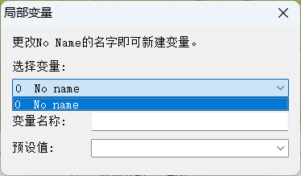
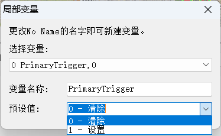

# 局部变量

在地图创作中，局部变量就是**对设计者有具体意义**的，**会因触发**（和动作脚本）**做出改变的**，**临时在某一局游戏起作用**的数值。  
局部变量在原版 YR 是有使用限制的：
- 它的值只能`0` `1`，可看作`bool`类型；
- 至多只能设 100 个局部变量，超出这个数量游戏中可能会崩溃

> [!note]
> `bool`类型的说明参见[百度百科](https://baike.baidu.com/item/BOOL/2065074)

## 变量的声明和使用
点击 FA2菜单栏 的 `编辑` 下拉列表中的 `局部变量` 选项，即可打开`局部变量`窗口，如下图所示：  

  

你可以点开下拉框，选中`No Name`，随便起一个名字，这样就**创建并声明**了一个局部变量.你也可以选中已有局部变量，重新指定它们的初始值（或者叫预设值）。

  
  


局部变量的**初始值**是 `0`，当然也可以手动将值设为 `1`。

无论局部变量的初始值是多少，若一个局部变量不被（触发或者脚本中）实际使用，那这个局部变量本身不代表任何意义。

那么在什么地方"使用"局部变量呢？有两个地方可以用到局部变量
- 在触发中的条件中，有一组事件和一组行为分别用于读写局部变量（设待操作的局部变量为x）：
  - 事件 36：（指定）局部变量被设定（值为 1），即`当 x = 1 时`；
  - 事件 37：（指定）局部变量被清除（0），即`当 x = 0 时`；
  * 行为 56：设置（指定）局部变量（值为 1），即`令 x = 1`；
  * 行为 57：清除（指定）局部变量（值），即`令 x = 0`。
- 在脚本的行为中，有两个行为用于只写局部变量（设待操作的局部变量为x）：
  - 行为 39：设置局部变量，即`令 x = 1`；
  - 行为 40：清除局部变量，即`令 x = 0`。

> [!note]
> 假设用程编程视角解释这些条件和结果，地编里所谓的`局部变量`其实和大多数编程语言中的`局部变量`的含义和作用几乎一致，所以`事件 36`和`事件 37`就分别像是`if(x == 1)`和`if(x == 0)` 。  
> 为了让有编程基础的读者能更好类比理解局部变量，下面将一个简单的触发“描述”成python代码：
> ```python
> # 实现一个判断局部变量的值为1时，
> # 执行一个文本触发事件（屏幕左上角提示文本），
> # 并将局部变量重新置0的触发
> if x == 1:  # 对应 触发条件36 “设置局部变量”
>   logScreen("触发被成功触发") # 对应 触发行为11 “文本触发事件”
>   x = 0      # 对应 触发行为57 “清除局部变量”
> ```

## 高阶用法：局部变量实现“与” “或” “非”
事实上，依据软硬件的逻辑等价性原理，触发确实可以做到或、非逻辑的判定。但显然，用累加去实现相乘，比起直接列个竖式配合九九乘法表，总是麻烦得多。自行实现的或、非逻辑也一样。


#### 与运算——相辅相成
局部变量可以很自然的参与到与运算的流程中，举两个例子：

- YR苏军战役第一关中，玩家开局拥有一些海蝎和台风潜艇，而每当台风潜艇或者海蝎全部被毁，地图外会刷出新的海蝎或者台风潜艇。以其中的一个刷出增援潜艇的部分触发为例，这其中包括：
  - 3个局部变量`Sub1/2/3 Dead`（对应3台潜艇  ）
  - 判断3台潜艇是否死亡的3个检测潜艇被摧毁的触发`Detect_Sub1/2/3 Dead`，条件为`48 被任何事物摧毁`，结果为`56 开启局部变量`，用于分别将3个局部变量的值置为1
  - 判断3个潜艇都被摧毁后刷出3台潜艇的增援触发`Reinforce_Subs`，条件为3个`36 局部开启...`，判断3个局部变量是否为1，结果为3个`7 援军(小队)...`，用于刷出3台潜艇
  - 而刷出的3台潜艇的3个动作脚本`Move to x/z/y`中，均有一个`40 - 清除局部变量`用来将对应的局部变量重置为0

- 原版苏军战役第一关中，五角大楼是由四个建筑组成的，当4个建筑全都被摧毁后，游戏才会胜利。这个效果是通过**设置4个局部变量**并**判断4个局部变量都为1**的方法实现的，其中包括：
  - 4个局部变量`Win 1/2/3/4`
  - 由4个`Pentagon 1/2/3/4`触发判断四个建筑是否被摧毁，每个触发的条件为`48 被任何事物摧毁`，分别判断4个建筑被摧毁。触发结果为`56 开启局部变量`，将对应的`Win 1/2/3/4`局部变量的值设为1
  - `Win Condition 1`触发中通过4个条件为`36 局部开启...`，判断4个局部变量是否为1。

> [!note]
> 由于触发条件和触发标签本身就支持跨对象的与运算，所以日常实践中通常组合使用**多个触发条件**和**重复类型**`1`来更便捷的实现简单的与运算流程，以上的两个例子的效果也可以通过**多个触发条件**和**重复类型**`1`组合来实现


#### 或运算——殊途同归
如今的任务有一个利好玩家的设计：如果玩家实在没钱（假定低于 $100），**或者**你的矿车被打没了，就给你派送几个钱箱子救急，所谓\*战争援助\*。不妨以这个设计为例。

那首先判断缺钱条件是有现成事件 `52 - 金钱低于`的，而判断缺少矿车的条件，在原版中可反向考虑用事件`20 - 生产特定类型的载具`判断玩家生产了矿车。如果任务流程足够简单，玩家和其他 AI阵营 生产的矿车是不同类型的，也可以用 YR 的事件 `61 - 科技类型不存在`判断当前存在于地图中某个类型的矿车数量。

条件输入、结果输出两端都梳理完毕，以下为一个实现示例：
- 设一局部变量`player low funds`，**初值为 0**；
- 触发 $I_1$：若玩家\*金钱低于\* $100，则令该变量值为 1；
- 触发 $I_2$：若玩家补牛（没有牛车），也令该变量值为 1；
- 触发 $O$：若该变量**值为 1**，则在指定路径点刷出奖励箱子。
- 以上触发的`重复类型`均为`2`，因为触发不能只因为某一时刻满足条件而触发一次就被“销毁”，是需要重复多次可触发的。

对应的伪代码如下：
```python
player_low_funds = 0
if creditsBelow(100):
  player_low_funds = 1
if noMiner:  # 取决于你怎么判断玩家缺牛车
  player_low_funds = 1
if player_low_funds == 1:
  create_crate(0, waypoint=81)  # 参数写 0 表示*大量金钱*
```

所谓「一真皆真」，这就是或逻辑的精髓。

#### 非运算——逆向思维
原版 RA2 A08 有这样一个任务流程：在计时器走完之前摧毁心灵信标。换言之，要求指定时间内摧毁目标（也就是计时器**没有超时**，并且目标被摧毁）。

在开始之前，不妨先捋一捋这个条件组的逻辑。这实际上是个必要不充分条件：要保证*完成流程*，必需满足如下条件：
1. 没超时
1. 目标被歼灭。  

但反过来，没超时推不出任务完成——目标可能还在。  

由于*目标被歼灭*这个分条件不需要非运算，因此重点关注 *流程能完成$`\Rightarrow`$没超时* 这一分路。

这一路条件按照设计得是真命题，原命题为真，其逆否命题也为真：*超时了$`\Rightarrow`$流程完不成*。这样就得到非运算的关键实现了。

有思路之后打开触发编辑器，现有这些条件与计时器有关：`流逝时间`、`计时器时间到`、`流逝游戏时间……` 无不判断一个计时器*超时*。根据刚刚得到的逆否命题，用局部变量实现非门电路，实现如下：

- 设一局部变量`obj1 reachable`，**初始为 1**；
- 触发 $I$：若计时器超时，则令该变量值为 0；
- 触发 $O$：若变量值**仍为 1**（即未超时），且目标不再存在，则宣布任务完成。
- 以上触发的`重复类型`均为`0`，因为条件满足一次即可完成所需效果，触发一次即可。

对应的伪代码如下：
```python
obj1_reachable = 1
if timeout:  # 取决于你用 13 14 还是 47
  obj1_reachable = 0
if obj1_reachable == 1 and techTypeNotExist("NAPSYB"):
  play_speech("EVA_ObjectiveComplete")
  ...
```
